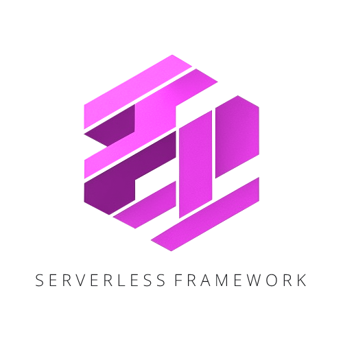

# Serverless Framework 

> Quickly start your next serverless api project.

---  

## Getting started

Read the documentation [here](https://edwin-luijten.github.io/serverless-framework/) to get started.

## Contributing