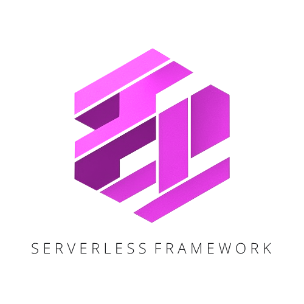

# Serverless Framework Create Project


## Contents

* [Usage](#usage)
* [Providers](#providers)

## Usage

```shell
npx @serverless-framework/create-roject <project-directory> <provider> [addons]
```

### Options
`--features` a comma separated list of addons. See [Providers](#providers) for more information.

## Providers

### AWS-Lambda
```shell
npx @serverless-framework/create-roject . aws-lambda [addons]
```
#### Features
- serverless
- localstack